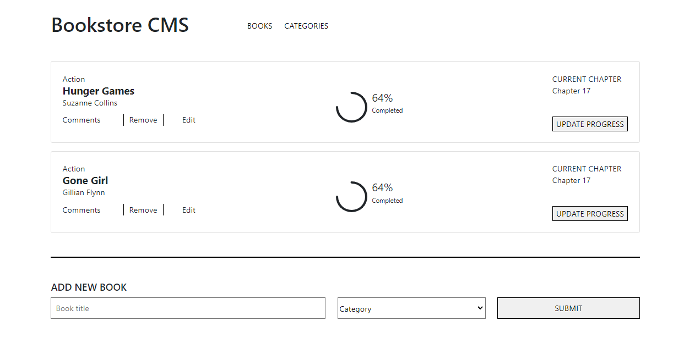

# bookstore_cms

Bookstore content management system

## Built With 🔨

- React
- Webpack

## Screenshot


## Setup

### Clone this repository

```bash
$ git clone https://github.com/jmoseka/bookstore_cms.git
$ cd react-math-magicians
```

### Run project

```bash
$ npm install
$ npm run start
```

### Open page in browser
```bash
open http://localhost:3000/
```

### Prerequisites

- IDE (VCode For me 🔥).
- Git and GitHub
- npm and node.js installed.

## Authors


👤 **Jamila Moseka**

- GitHub: [@jmoseka](https://github.com/jmoseka)
- Linkedin [Jamila Moseka](https://www.linkedin.com/in/jamila-moseka/)
- Twitter [@milamoseka](https://twitter.com/milamoseka)

## 🤝 Contributing

Contributions, issues and feature requests are welcome!

## Show your support

Give a ⭐️ if you like this project!

## Acknowledgments

- Hat tip to anyone whose code was used
- Inspiration
- etc

